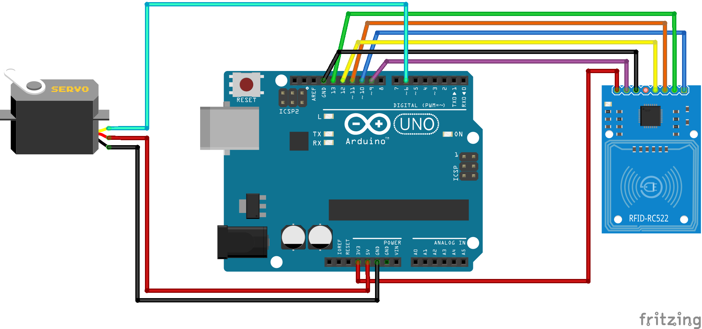
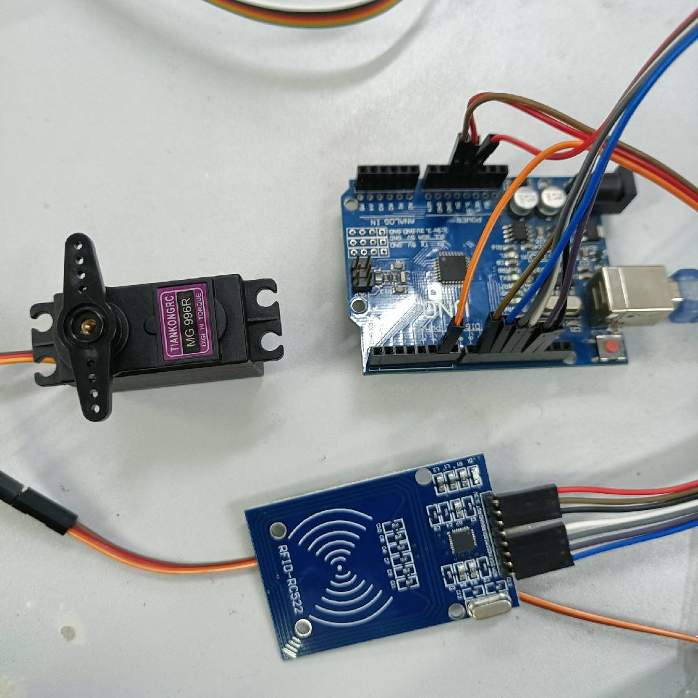
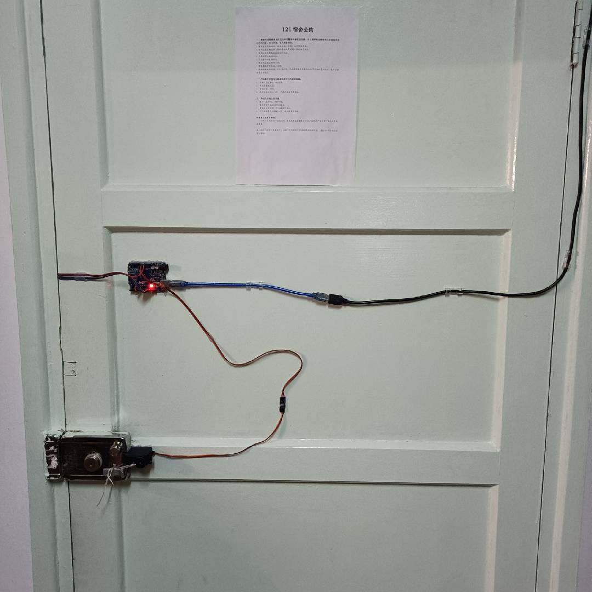
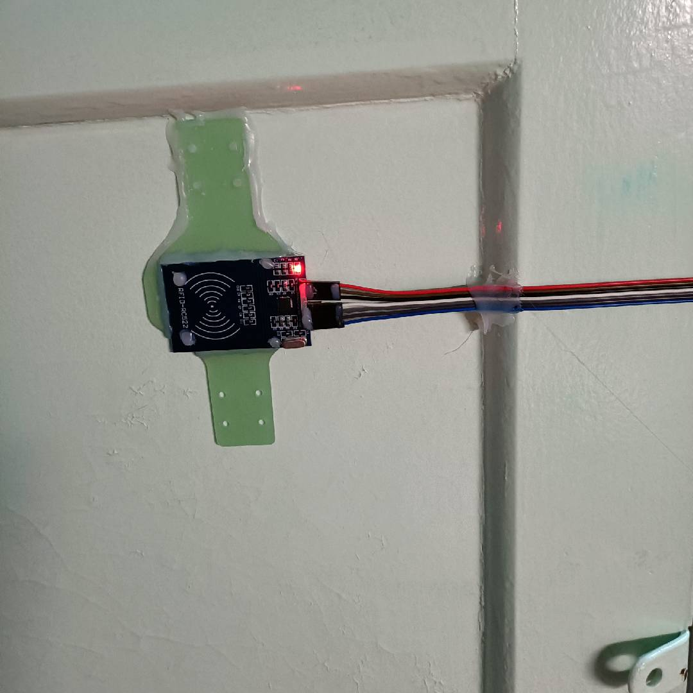
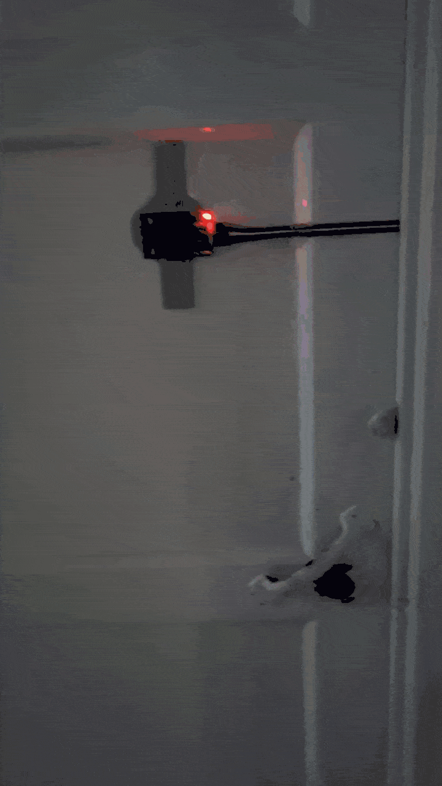

# 华科寝室简易门禁

华科宿舍的大门门禁用学生卡开，而每个寝室的门却只能使用钥匙打开。这就导致了每次出门都要带上学生卡和钥匙，每次回来都要先掏出卡，再掏出钥匙。这样实在是麻烦，因此我有了用校园卡就能打开宿舍门的想法。

## 准备工作

### 参考资料

- MFRC522 官方手册 [doc](https://www.nxp.com.cn/docs/en/data-sheet/MFRC522.pdf)

- 李乾文的博客 [RFID-RC522读IC卡](https://blog.csdn.net/leytton/article/details/73480974)

- 同宿舍楼上一位学长的 [博文](https://www.bilibili.com/read/cv7832399?spm\_id\_from=333.999.0.0) 及 [GitHub 仓库](https://github.com/yllhwa/nfchello)

- 他博客中引用的链接 [文章](https://zhuanlan.zhihu.com/p/66467989) 及 [GitHub 仓库](https://github.com/Ghastlcon/Access-Control)

### 材料准备

| 名称 | 用途 | 预算(RMB) |
| --- | --- | --- |
| USB 延长线（公对母） | 供电 | 6 |
| USB 带开关延长线 | 开关 | 10 |
| Arduino UNO R3 开发板 | 控制 | 12 |
| MG996R 舵机 | 开门 | 13 |
| RC522 IC 卡感应模块 | 读卡 | 5 |
| 杜邦线 | 接线 | 0 （白嫖） |

合计：46 RMB

### 工具准备

| 名称 | 用途 | 预算(RMB) |
| --- | --- | --- |
| 热熔胶枪和若干胶棒 | 固定 | 20 |
| 焊台 | 焊接 | 0 （白嫖） |

合计：20 RMB

### 开发环境

- **arduino-cli** 0.21.1
	- **core** : arduino:avr 1.8.5
	- **lib** : MFRC522 1.4.10

- **Fritzing** 0.9.9 beta

## 连线及原理图

RC522 模块的库是网上找的，在连线图上标识不够清晰，可以参考原理图来布线。

- 连线



- 原理图


## 配置及使用

编译烧录运行`./src/get-id/get-id.ino`以获得卡的 UID。

创建文件`./src/access-control/card-group.hpp`，添加如下代码：

``` cpp
#define CARD_NUM {卡的数量}
#define UID_SIZE 4

static const byte card_group[CARD_NUM][UID_SIZE] =
{
    { 0x00, 0x00, 0x00, 0x00 },
    { 0x00, 0x00, 0x00, 0x00 },
//    ...
};
```

编译烧录`./src/access-control/access-control.ino`则可以使用这个简易门禁了！

## 效果图

- 连线完成效果



- 安装完成效果





- 使用效果

